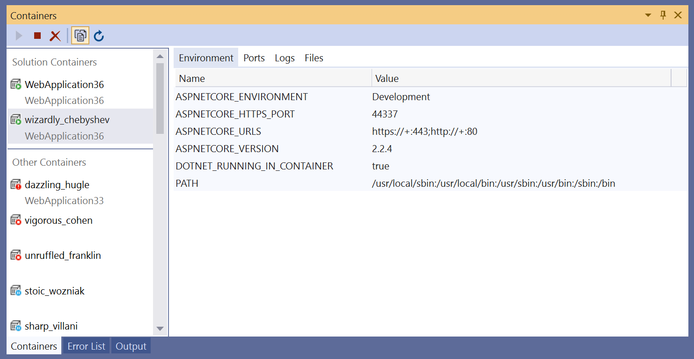
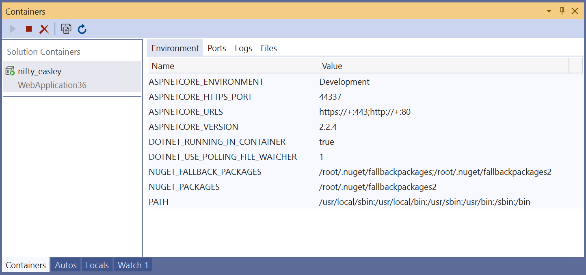
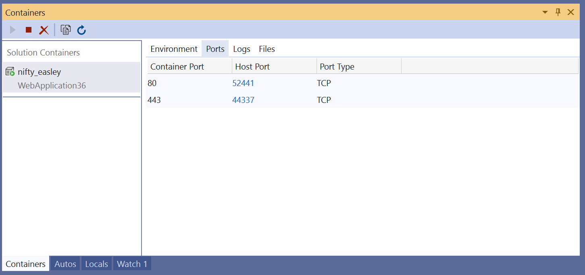
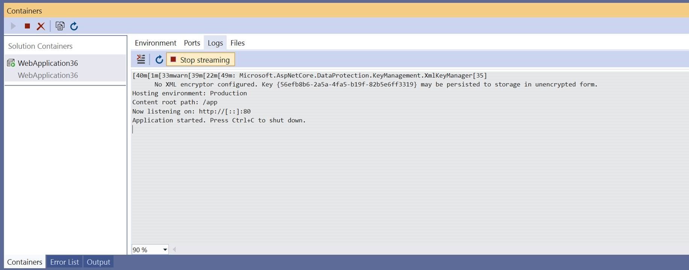
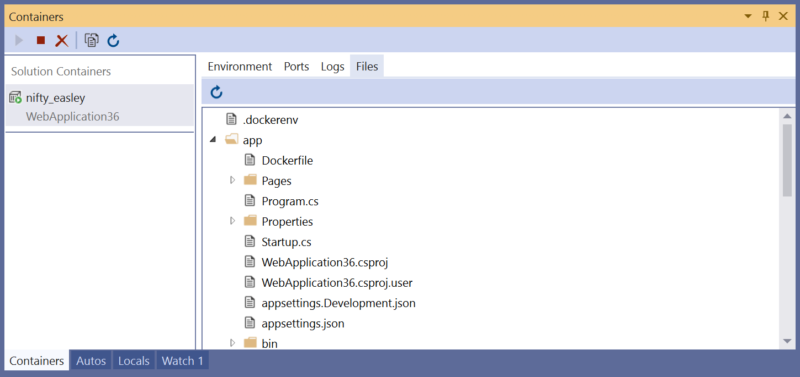
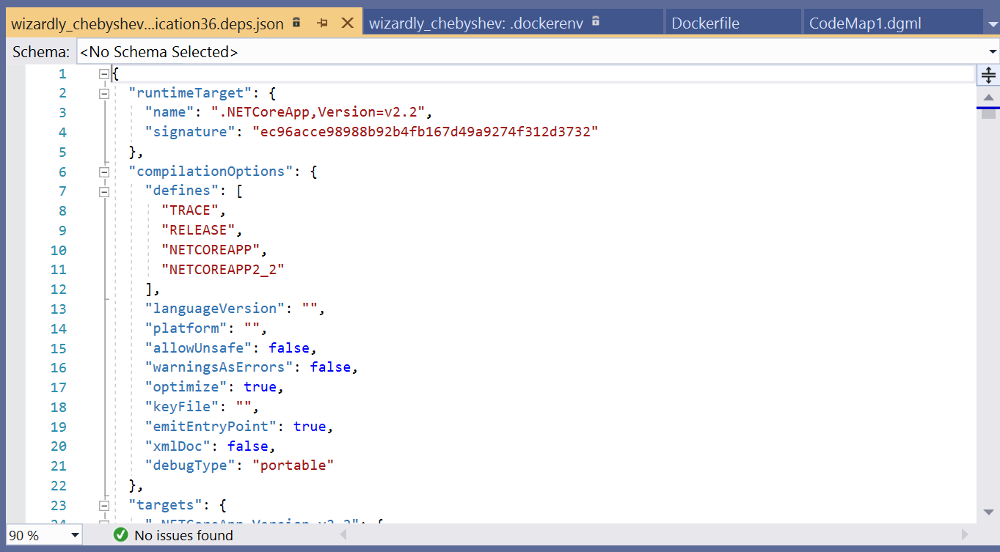

# How to view and diagnose containers in Visual Studio

You can view what's going on inside the containers that host your app by using the **Containers** window. If you're used to using the command prompt to run Docker commands to view and diagnose what's going on with your containers, this window provides a more convenient way to monitor your containers without leaving the Visual Studio IDE.

> [!NOTE]
> The Containers window is currently available as a Preview extension that you can [download](https://aka.ms/vscontainerspreview) for Visual Studio 2019.

## Prerequisites

- [Docker Desktop](https://hub.docker.com/editions/community/docker-ce-desktop-windows)
- Install [Visual Studio 2019](https://visualstudio.microsoft.com/downloads)
- Install the [Containers window extension](https://aka.ms/vscontainerspreview)

## View information about your containers

The **Containers** window opens automatically when you start a containerized .NET project. To view your containers in Visual Studio at any time, use **Ctrl**+**Q** to activate the Visual Studio Search box, and type `Containers` and choose the first item. You can also open the **Containers** window from the main menu. Use the menu path  **View** > **Other Windows** > **Containers**.  

On the left side, you see the list of containers on your local machine. The containers associated with your solution are shown under **Solution Containers**. To the right, you see a pane with tabs for **Environment**, **Ports**, **Logs**, and **Files**.

> [!TIP]
> You can easily customize where the **Containers** tool window is docked in Visual Studio. See [Customizing window layouts in Visual Studio](/visualstudio/ide/customizing-window-layouts-in-visual-studio). By default, the **Containers** window is docked with the **Watch** window when the debugger is running.

## View environment variables

The **Environment** tab shows the environment variables in the container. For your app's container, you can set these variables in many ways, for example, in the Dockerfile, in a .env file, or by using the -e option when you start a container using a Docker command.

> [!NOTE]
> Any changes to the environment variables aren't reflected in real time. Also, the environment variables in this tab are the system environment variables on the container, and do not reflect user environment variables local to the app.

## View port mappings

On the **Ports** tab, you can check the port mappings that are in effect for your container.

Well-known ports are linked, so if there's content available on a port, you can click on the link to open the browser.

## View logs

The **Logs** tab shows the results of the `docker logs` command. By default, the tab shows stdout and stderr streams on a container, but you can configure the output. For details, see [Docker logging](https://docs.docker.com/config/containers/logging/).  By default, the **Logs** tab streams the logs, but you can disable that by choosing the **Stop** button on the tab.

To clear the logs, use the **Clear** button on the **Logs** tab.  To get all the logs, use the **Refresh** button.

> [!NOTE]
> Visual Studio automatically redirects stdout and stderr to the **Output** window, so containers started from Visual Studio (that is, the containers in the **Solution Containers** section) will not display logs in this tab; use the **Output** window instead.

## View the filesystem

On the **Files** tab, you can view the container's filesystem, including the app folder that contains your project.

To open files in Visual Studio, browse to the file and double-click it, or right-click and choose **Open**. Visual Studio opens files in read-only mode.

Using the **Files** tab, you can view application logs such as IIS logs, configuration files, and other content files in your container's filesystem.

## Start, stop, and remove containers

By default, the **Containers** window shows all containers on the machine that Docker manages. You can use the toolbar buttons to start, stop, or remove (delete) a container you no longer want.  This list is dynamically updated as containers are created or removed.

## Next steps

Learn more about the Container Tools available in Visual Studio by reading the [Container Tools Overview](overview.md).

## See also

[Container Development in Visual Studio](/visualstudio/containers)

[Extensions Marketplace for Visual Studio](https://marketplace.visualstudio.com/)
