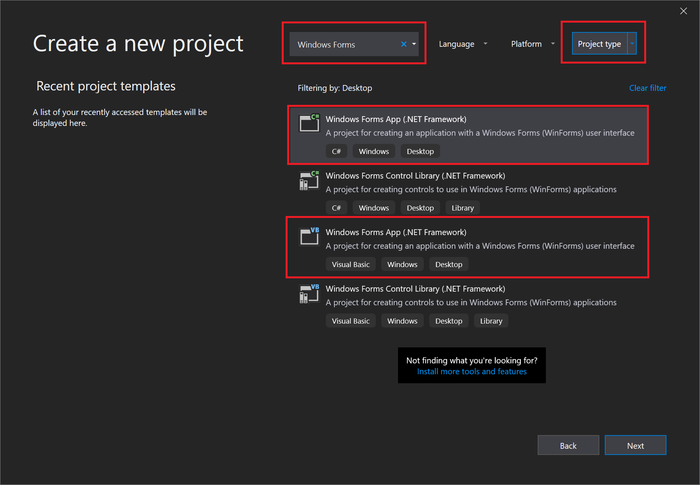

# Step 1: Create a Windows Forms App project

When you create a picture viewer, the first step is to create a Windows Forms App project.

::: moniker range="vs-2017"

## Open Visual Studio 2017

1. On the menu bar, choose **File** > **New** > **Project**. The dialog box should look similar to the following screenshot.

      ***New project*** *dialog box*

2. On the left side of the **New Project** dialog box, choose either **Visual C#** or **Visual Basic**, and then choose **Windows Desktop**.

3. In the project templates list, choose **Windows Forms App (.NET Framework)**. Name the new form *PictureViewer*, and then choose the **OK** button.

    >[!NOTE]
    >If you don't see the **Windows Forms App (.NET Framework)** template, use the Visual Studio Installer to install the **.NET desktop development** workload.     For more information, see the [Install Visual Studio](../install/install-visual-studio.md) page.

::: moniker-end

::: moniker range="vs-2019"

## Open Visual Studio 2019

1. On the start window, choose **Create a new project**.

   

1. On the **Create a new project** window, enter or type *Windows Forms* in the search box. Next, choose **Desktop** from the **Project type** list.

   After you apply the **Project type** filter, choose the **Windows Forms App (.NET Framework)** template for either C# or Visual Basic, and then choose **Next**.

   

   > [!NOTE]
   > If you don't see the **Windows Forms App (.NET Framework)** template, you can install it from the **Create a new project** window. In the **Not finding what you're looking for?** message, choose the **Install more tools and features** link.
   >
   > 
   >
   > Next, in the Visual Studio Installer, choose the Choose the **.NET desktop development** workload.
   >
   > 
   >
   > After that, choose the **Modify** button in the Visual Studio Installer. You might be prompted to save your work; if so, do so. Next, choose **Continue** to install the workload.

1. In the **Configure your new project** window, type or enter *PictureViewer* in the **Project name** box. Then, choose **Create**.

::: moniker-end

Visual Studio creates a solution for your app. A solution acts as a container for all of the projects and files needed by your app. These terms will be explained in more detail later in this tutorial.

## About the Windows Forms App project

1. The development environment contains three windows: a main window, **Solution Explorer**, and the **Properties** window.

     If any of these windows are missing, you can restore the default window layout. On the menu bar, choose **Window** > **Reset Window Layout**.

     You can also display windows by using menu commands. On the menu bar, choose **View** > **Properties Window** or **Solution Explorer**.

     If any other windows are open, close them by choosing the **Close** (x) button in their upper-right corners.

    ::: moniker range="vs-2017"

    * **Main window** In this window, you'll do most of your work, such as working with forms and editing code. The window shows a form in the **Form Editor**. At the top of the window, the **Start Page** tab and the **Form1.cs [Design]** tab appear. (In Visual Basic, the tab name ends with *.vb* instead of *.cs*.)

    ::: moniker-end

    ::: moniker range=">=vs-2019"

    * **Main window** In this window, you'll do most of your work, such as working with forms and editing code. The window shows a form in the **Form Editor**.

    ::: moniker-end

    * **Solution Explorer window** In this window, you can view and navigate to all items in your solution.

    If you choose a file, the contents of the **Properties** window changes. If you open a code file (which ends in *.cs* in C# and *.vb* in Visual Basic), the code file or a designer for the code file appears. A designer is a visual surface onto which you can add controls such as buttons and lists. For Visual Studio forms, the designer is called the **Windows Forms Designer**.

    * **Properties window** In this window, you can change the properties of items that you choose in the other windows. For example, if you choose Form1, you can change its title by setting the **Text** property, and you can change the background color by setting the **Backcolor** property.

      > [!NOTE]
      > The top line in **Solution Explorer** shows **Solution 'PictureViewer' (1 project)**, which means that Visual Studio created a solution for you. A solution can contain more than one project, but for now, you'll work with solutions that contain only one project.

1. On the menu bar, choose **File** > **Save All**.

     As an alternative, choose the **Save All** button on the toolbar, which the following image shows.

      
     ***Save All*** *toolbar button*

     Visual Studio automatically fills in the folder name and the project name and then saves the project in your projects folder.

## Next steps

* To go to the next tutorial step, see **[Step 2: Run your app](../ide/step-2-run-your-program.md)**.

* To return to the overview topic, see [Tutorial 1: Create a picture viewer](../ide/tutorial-1-create-a-picture-viewer.md).

## See also

* [Tutorial 2: Create a timed math quiz](tutorial-2-create-a-timed-math-quiz.md)
* [Tutorial 3: Create a matching game](tutorial-3-create-a-matching-game.md)
